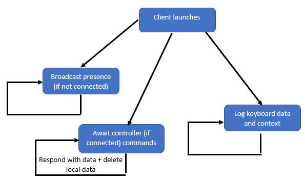

client
=============

The core keylogger operating on the host. It broadcasts itself to the controller, records actions on the host and sends the controller data when requested.

   Logic flowchart.

.. automodule:: client
    :members:
    :undoc-members:
    :show-inheritance:
