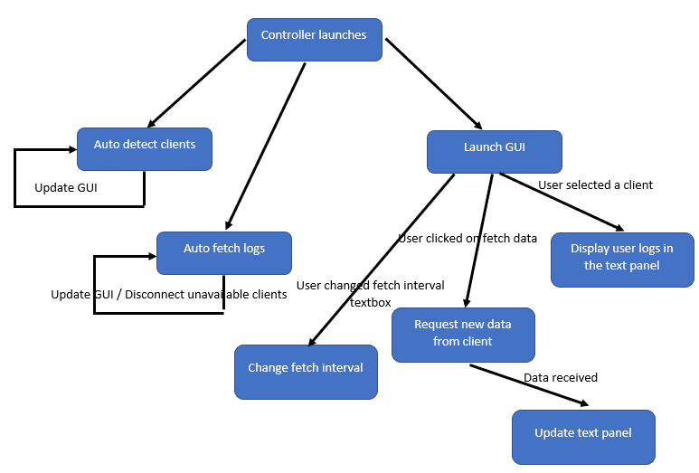

controller
=============

Handles host discobery and allows the user to manage the hosts with UI as frontend.

   Logic flowchart.

.. automodule:: controller
    :members:
    :undoc-members:
    :show-inheritance:
